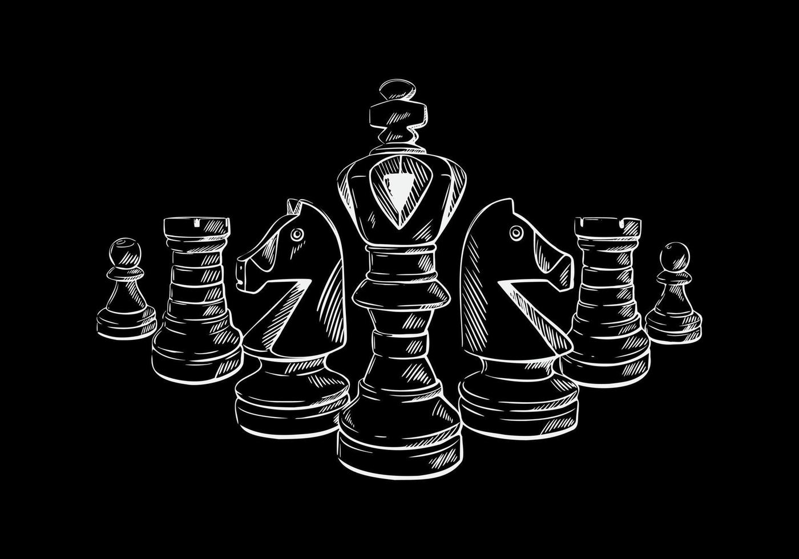

**<h1>Clasificador de Imágenes con Redes Convolutivas</h1>**

---

<strong>Autores:</strong> Hernández Guerra, Luna Yue y Casimiro Torres, Kimberly

<strong>Universidad de Las Palmas de Gran Canaria (ULPGC)</strong>

---

**<h2>PIEZAS DE AJEDREZ</h2>**

**<h3 style="text-align: center;">Conjunto de Imágenes</h3>**

    <table style="margin: 0 auto; border-collapse: collapse; width: 50%; text-align: center; border: 1px solid black;">
        <thead>
            <tr style="background-color: #000000; color: white;">
                <th style="border: 1px solid black; padding: 8px; text-align: center;">Etiqueta (Inglés)</th>
                <th style="border: 1px solid black; padding: 8px; text-align: center;">Etiqueta (Español)</th>
                <th style="border: 1px solid black; padding: 8px; text-align: center;">Número de Imágenes</th>
            </tr>
        </thead>
        <tbody>
            <tr>
                <td style="border: 1px solid black; padding: 8px; text-align: center;">Bishop</td>
                <td style="border: 1px solid black; padding: 8px; text-align: center;">Alfil</td>
                <td style="border: 1px solid black; padding: 8px; text-align: center;">87</td>
            </tr>
            <tr>
                <td style="border: 1px solid black; padding: 8px; text-align: center;">King</td>
                <td style="border: 1px solid black; padding: 8px; text-align: center;">Rey</td>
                <td style="border: 1px solid black; padding: 8px; text-align: center;">76</td>
            </tr>
            <tr>
                <td style="border: 1px solid black; padding: 8px; text-align: center;">Knight</td>
                <td style="border: 1px solid black; padding: 8px; text-align: center;">Caballo</td>
                <td style="border: 1px solid black; padding: 8px; text-align: center;">106</td>
            </tr>
            <tr>
                <td style="border: 1px solid black; padding: 8px; text-align: center;">Pawn</td>
                <td style="border: 1px solid black; padding: 8px; text-align: center;">Peón</td>
                <td style="border: 1px solid black; padding: 8px; text-align: center;">107</td>
            </tr>
            <tr>
                <td style="border: 1px solid black; padding: 8px; text-align: center;">Queen</td>
                <td style="border: 1px solid black; padding: 8px; text-align: center;">Reina</td>
                <td style="border: 1px solid black; padding: 8px; text-align: center;">78</td>
            </tr>
            <tr>
                <td style="border: 1px solid black; padding: 8px; text-align: center;">Rook</td>
                <td style="border: 1px solid black; padding: 8px; text-align: center;">Torre</td>
                <td style="border: 1px solid black; padding: 8px; text-align: center;">102</td>
            </tr>
        </tbody>
    </table>

El conjunto de datos utilizado en este proyecto contiene imágenes de seis tipos diferentes de piezas de ajedrez: **Alfil (Bishop), Rey (King), Caballo (Knight), Peón (Pawn), Reina (Queen) y Torre (Rook)**. Las imágenes han sido recopiladas principalmente del [conjunto de datos de Kaggle](https://www.kaggle.com/datasets/niteshfre/chessman-image-dataset/data), el cual incluye una variedad de recursos preprocesados para este tipo de proyectos. Este conjunto de datos proporciona 556 imágenes con diferentes dimensiones.

**<h3 style="text-align: center;">Resultados</h3>**